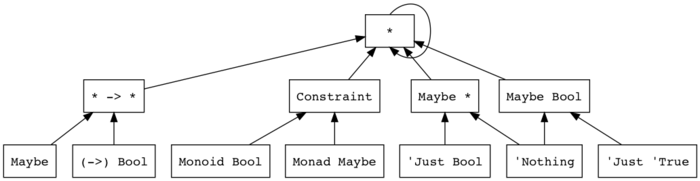

Haskellには種(kind)という仕組みがあります。大雑把に言ってしまえば、「型の型」を実現する仕組みです。この仕組みについて、あまり情報が出回っていないようなので、解説記事を残しておこうと思います。なお、前編と後編に分かれていて、この記事は後編になります。前編は[こちら][part1-link]になります。

この記事は、[Ladder of Functional Programming](http://lambdaconf.us/downloads/documents/lambdaconf_slfp.pdf) ([日本語訳](http://qiita.com/lotz/items/0d68c8440d1f362d0c32))の**FIRE LUBLINE(ADVANCED BEGINNER)**を対象に、[Part 1][part1-link]の続きとして、種に付随するGHC言語拡張やパッケージを紹介するものです。

なお、特に断らない限り、対象としてGHC8系を設定しています。`stack`を使ってる方は`resolver`をLTS Haskell 8以降に設定しておくことを推奨します。

## 様々な種

### 型制約の種

[前回の記事][part1-link]では、種の基本的な仕組みを紹介しました。全てのデータ型は`*`という種を持っており、データ宣言は`*`の種を持つ型を作る型コンストラクタを定義するのでした:
```haskell
>>> newtype WrappedInt = WrappedInt Int
>>> :kind WrappedInt
WrappedInt :: *
>>> data Tag a = Tag
>>> :kind Tag
Tag :: * -> *
```

さて、Haskell標準には上のようなデータ型を表す`*`と、型コンストラクタを表す`k1 -> k2`という形の種しかありませんでした。GHCでは、他にもいくつか種を導入しています。今日は、その幾つかを紹介していきます。一つ目が、型制約を表す種`Constraint`です。この種を伴う仕組みは`ConstraintKinds`拡張により導入できます。

Haskellの型上には、データ型や型コンストラクタの他にも、型制約という登場人物がいました。型制約は名前の通り、型の制約が書けるようにするものでした。以下の関数をみてください:
```haskell
minByOrd :: Ord a => a -> a -> a
minByOrd x y = if x < y then x else y
```
この関数`minByOrd`は、型`a`が順序を持つ(`Ord a`のインスタンスである)という制約を満たしている時、二つの引数のうち小さい方を`Ord`のメソッド`<`を使用して返します。

型制約は、型クラスを使うことで作ることができました。例えば、ある型がデフォルトの値を持つという制約は、以下のように書けます:
```haskell
class HasDefault a where
  defaultValue :: a
```
この型クラスを使うことで、デフォルトの値を持つ型制約を満たしている型上では、`defaultValue`メソッドを使用することができるようになるのでした。例えば、以下のようにです:
```haskell
fromMaybe :: HasDefault a => Maybe a -> a
fromMaybe (Just x) = x
fromMaybe Nothing  = defaultValue
```

実はGHC上では、型制約にも種が割り当てられています。見てみましょう:
```haskell
>>> :kind HasDefault
HasDefault :: * -> Constraint
```
`HasDefault`型クラスは、`*`の種を持つ型を受け取り、`Constraint`の種を持つ型制約を返します。`Constraint`はGHCが導入している、型制約を表す種です。型制約は、GHC上ではこの型制約種`Constraint`を持ちます。つまり、`HasDefault :: * -> Constraint`は、`*`の種の型、つまりデータ型を一つ受け取り、型制約になるような型上の関数になります。実際に、データ型を適用して型制約にしてみましょう:
```haskell
>>> :kind HasDefault Bool
HasDefault Bool :: Constraint
```
適用結果は、ちゃんと`Constraint`の種を持っています。ここで、種の計算では型の計算は行われないことに注意してください！`kind`コマンドは、型の計算は行わないのでした。私たちは、`Bool`を`HasDefault`のインスタンスにしていないため、実際にはこの型制約は満たされません。型の計算を実際に行ってみましょう。上で定義した`fromMaybe`を実際に`Bool`型の値に使ってみます:
```haskell
>>> :type fromMaybe $ Just True

<interactive>:1:1: error:
    • No instance for (HasDefault Bool)
        arising from a use of ‘fromMaybe’
    • In the expression: fromMaybe $ Just True
```
「`HasDefault`は`Bool`に対してインスタンスを持っていない」と型エラーになっていることが分かります。このように型の計算は`type`コマンドで確かめることができるのでした。これらの型計算は、もう少し直接的に確かめることもできます。次を見てください:
```haskell
>>> :set -XFlexibleContexts
>>> :type undefined :: HasDefault Bool => Bool

<interactive>:1:1: error:
    No instance for (HasDefault Bool) arising from a use of ‘it’
```
このように、型の計算だけを行わせる場合、`undefined`を使用するのが便利です。Haskell標準では、型制約はあまり柔軟には書けません。そこから、具体的な型を伴う上の制約も書けないため、`FlexibleContexts`拡張を使用することで書けるようにしています。

さて、以上の型表記で登場する、`=>`というものは、左で指定された型制約を満たしているならば右で指定された型付けの関数になる、という意味を持っています。つまり、型上の演算子として考えるなら、`(=>) :: Constraint -> * -> *`という種になります。なので、例えば以下のような型表記は、種の辻褄が合わなくなります:
```haskell
>>> :kind Int => Bool

<interactive>:1:1: error:
    • Expected a constraint, but ‘Int’ has kind ‘*’
    • In the type ‘Int => Bool’
>>> :kind HasDefault => Bool

<interactive>:1:1: error:
    • Expecting one more argument to ‘HasDefault’
      Expected a constraint, but ‘HasDefault’ has kind ‘* -> Constraint’
    • In the type ‘HasDefault => Bool’
```
`kind`コマンドによって、種が合わないとエラーになっていることが分かります。残念ながら、`=>`は実際には型演算子ではなく、`(=>)`というように型関数として扱うことはできません。ですが、それは表記上の問題であり、確かに種の計算の際、型制約を受け取る型演算子として、`Constraint`の種を持つか検査が行われていることは分かるでしょう。

さて、今までは型制約を表す種`Constraint`について、GHCi上で色々試しながら見てきました。型制約種に関しての雰囲気は分かってもらえたと思います。型制約種`Constraint`をもう少し詳しく見ていきましょう。以下を見てください:
```haskell
>>> data SimpleData a = SimpleData a
>>> :kind SimpleData
SimpleData :: * -> *
>>> class SimpleClass a where simpleMethod :: a -> a
>>> :kind SimpleClass
SimpleClass :: * -> Constraint
```
データ宣言と型クラス宣言を並べてみました。この二つはよく似ています。

* データ宣言は、`*`という種の型になるような型コンストラクタ`SimpleData :: * -> *`を作り、`SimpleData :: a -> SimpleData`という値コンストラクタを作ります。
* 型クラス宣言は、`Constraint`という種の型制約になるような`SimpleClass :: * -> Constraint`を作り、`simpleMethod :: SimpleClass a => a -> a`というような関数を作ります。

作られるものがそれぞれ違いますが、両方型の世界に一つの型関数、値の世界に関数を作るわけです。型クラスの方をデータ宣言に合わせるとしたら、型クラスは型制約コンストラクタとメソッドを作るものと言えるかもしれません。型の世界だけでの話なら、データ宣言は型コンストラクタを、型クラスは型制約コンストラクタを単に作るだけの構文ということになります。ではここで、データ型と型制約の対比を表にしてみましょう。

| 種 | 表現される型 | 定義方法 |
| --- | --- | --- |
| `*` | データ型 | データ宣言(`data C a = ...`) |
| `Constraint` | 型制約 | 型クラス宣言(`class C a where ...`) |

両者はそれぞれ特別な意味を与えられています。実際、データ型が値を持ち[^notice-data-type]それによって型注釈が書けるように、型制約は`=>`というような特別に型制約を計算するような、型上の構文を持っています。ですが、逆に言えば特別なのはそれだけで、それ以外に両者の違いはありません。例えば、`Proxy`型に型制約や型制約コンストラクタ(型クラス)を渡すこともできます:
```haskell
>>> import Data.Proxy
>>> :kind Proxy
Proxy :: k -> *
>>> :type Proxy :: Proxy (Monoid Bool)
Proxy :: Proxy (Monoid Bool) :: Proxy (Monoid Bool)
>>> :type Proxy :: Proxy Monoid
Proxy :: Proxy Monoid :: Proxy (Monoid Bool)
```
`=>`を使用していないので、型制約の計算は行われないことに注意してください！`Proxy`型は種多相化されており、どんな種の型も受け取れるのでした。

* `Proxy :: Proxy (Monoid Bool)`の場合は、`Proxy :: Constraint -> *`
* `Proxy :: Proxy Monoid`の場合は、`Proxy :: (* -> Constraint) -> *`

というようにそれぞれ`Proxy`型コンストラクタが特殊化されます。では、この`Proxy`で型制約を受け取り、型制約の計算だけを行うような関数を作って使って見ましょう。その関数は、以下のように作ることができます:
```haskell
>>> :set -XConstraintKinds
>>> f :: a => Proxy a -> (); f _ = ()
>>> -- この段階では、まだ型制約計算されない!
>>> Proxy :: Proxy (Monoid Bool)
Proxy
>>> -- 型制約計算をする関数に適用
>>> f (Proxy :: Proxy (Monoid Bool))

<interactive>:24:1: error:
    • No instance for (Monoid Bool) arising from a use of ‘f’
    • In the expression: f (Proxy :: Proxy (Monoid Bool))
      In an equation for ‘it’: it = f (Proxy :: Proxy (Monoid Bool))
>>> f (Proxy :: Proxy (Monoid String))
()
```
やっと、`ConstraintKinds`拡張の登場です。`ConstraintKinds`拡張は、型制約に関するHaskell標準の制限を幾つか取り払う拡張です。どのようなことが可能になるかは後で紹介するとして、今は上の関数の使い方に注目しましょう。この`Constraint`種のこのように、型制約は`Proxy`型で持ち回し`=>`で任意のタイミングで型制約計算を行うといったことも可能です。面白いですね。

[^notice-data-type]: 型コンストラクタは値を持てないことに注意してください！何らかの値を持つ型は全て`*`という種を持つものになっており、例えば`Maybe :: * -> *`という型コンストラクタはそれだけでは値を持たず、`Maybe Int`など型を一つ渡して初めて値を持つような型になるのでした。

上の`Proxy`を使った例から明らかですが、もちろんデータ宣言時に種注釈を使うことで型制約を受け取るようなデータ型を作ることもできるわけです。そして、型制約を受け取るような型クラスもです。次の例を見てください:
```haskell
>>> :set -XKindSignatures -XFlexibleInstances
>>> import GHC.Exts (Constraint)
>>> class AConstraint (c :: Constraint)
>>> :kind AConstraint
AConstraint :: Constraint -> Constraint
>>> instance AConstraint (Monad Maybe)
```
`FlexibleInstances`拡張は、`FlexibleContexts`拡張と同じような拡張で、`FlexibleContexts`は型制約の書き方の制限を、`FlexibleInstances`拡張はインスタンスの書き方の制限をそれぞれ取り払う拡張です。また、`Constraint`種は`GHC.Exts`モジュールに入っていて、使用する際はこのモジュールを`import`する必要があります。これらを使って、上のようにすれば、型制約の分類分けすらすることができるようになります。

さて、他にも`Constraint`に関連する特殊な型上の演算子があります。普段気にも留めていなかったと思いますが、型制約のペアです。GHC上では、以下のような型制約が書けます:
```haskell
>>> -- 常に型制約は満たされる
>>> :type undefined :: () => a
undefined :: () => a :: a
>>> -- 二つの型制約が満たされる場合に、満たされる
>>> :type undefined :: (Monad m, Monoid a) => m a
undefined :: (Monad m, Monoid a) => m a
  :: (Monoid a, Monad m) => m a
>>> -- 以下の二つは同じ
>>> :set -XConstraintKinds
>>> :type undefined :: (Monad m, Monoid a, Show a) => m a
undefined :: (Monad m, Monoid a, Show a) => m a
  :: (Show a, Monoid a, Monad m) => m a
>>> :type undefined :: ((Monad m, Monoid a), Show a) => m a
undefined :: ((Monad m, Monoid a), Show a) => m a
  :: (Show a, Monoid a, Monad m) => m a
```
最後の例では`ConstraintKinds`拡張を使用していますが、これについては最後にどんな拡張なのか説明しましょう。今、注目してもらいたいのは、型制約のペアについてです。普段何気なく使っていると思いますが、これらも一種の型制約の演算子と見ることができるわけです。注意してもらいたいのが、この演算子はタプル型と同じ形式だということです。次を見てください:
```haskell
>>> :kind ()
() :: *
>>> :kind (Bool, Int)
(Bool, Int) :: *
>>> :kind (Monad Maybe, Monoid Bool)
(Monad Maybe, Monoid Bool) :: Constraint
>>> :kind (Bool, Monad Maybe)

<interactive>:1:8: error:
    • Expected a type, but ‘Monad Maybe’ has kind ‘Constraint’
    • In the type ‘(Bool, Monad Maybe)’
>>> :kind (Monad Maybe, Bool)

<interactive>:1:15: error:
    • Expected a constraint, but ‘Bool’ has kind ‘*’
    • In the type ‘(Monad Maybe, Bool)’
```
`()`は、ユニット型の方が優先されています。`(,)`は、最初に書いた型の種によって、受け取る種が左右されていることが分かりますね。型制約のペアは、`(,) (Monad Maybe) (Monoid Bool)`というような表記は許容されていませんが、それ以外はあまりタプル型と変わりありません。異なるのは、タプル型が幾つかのデータ型を受け取って一つのデータ型となるのに対し、型制約のペアは型制約を幾つか受け取りそれを全て満たすような型制約になるということです。

最後に`ConstraintKinds`拡張をきちんと紹介しておきましょう。`ConstraintKinds`拡張は、次のようなことを可能にしてくれる拡張です。

* 型エイリアスと同じ構文で、型制約コンストラクタのエイリアスを書くことができるようになる。

    つまり、次のようなことが可能になります:
    ```haskell
    {-# LANGUAGE ConstraintKinds #-}

    -- 型制約のエイリアス
    type MonMonad m a = (Monoid (m a), Monad m)

    -- 型制約コンストラクタのエイリアス
    type Mappable = Functor
    ```

* 型制約種`Constraint`を持つ型を、型制約として使用できるようにする。

    こちらは、あまり実感が湧かないかもしれません。デフォルトで、GHCでは型クラスなどを型制約として扱う、つまり特に問題なく`=>`に渡すことができます。ですが、`Constraint`の種を持つ型制約変数などを渡すことはできません:
    ```haskell
    >>> import Data.Proxy
    >>> -- 型クラスを型制約として使っているため、問題ない
    >>> :type undefined :: Monad m => m a
    undefined :: Monad m => m a :: Monad m => m a
    >>> -- 型制約変数は、型制約として扱えない
    >>> :type undefined :: a => Proxy a

    <interactive>:1:14: error:
        • Illegal constraint: a (Use ConstraintKinds to permit this)
        • In an expression type signature: a => Proxy a
          In the expression: undefined :: a => Proxy a
    >>> :set -XConstraintKinds
    >>> -- 型制約種を持つものなら、型制約として扱えるようになる
    >>> :type undefined :: a => Proxy a
    undefined :: a => Proxy a :: a => Proxy a
    ```
    `((Monad m, Monoid a), Show a)`などが標準で扱えないのも、`(Monad m, Monoid a)`という形式のものは型制約種を持ってはいますが、標準で許容されている形式ではありません。このような場合に、より柔軟に扱えるようにしてくれる拡張が、`ConstraintKinds`です。

型制約種`Constraint`について、馴染んでもらえたでしょうか？普段、この種や`ConstraintKinds`を明示的に使うような場面は少ないかもしれませんね。もし、型制約種について興味を持ったなら、[constraints](http://hackage.haskell.org/package/constraints)というパッケージを見てみるのが良いでしょう。このパッケージは、型制約プログラミングに関する幾つかの有用なAPIを提供しています。

### データ型の昇格

今までは、`*`や`Constraint`、`k1 -> k2`といった、予め用意された特別な種を紹介してきました。GHC上で、私たちが種を定義するような方法も、実は用意されています。それが、`DataKinds`という拡張です。`DataKinds`は基本的には簡単な拡張です。

私たちは、以下のようなデータ宣言を使ってデータ型を定義することができました:
```haskell
data SimpleData a = SimpleData a
```
このデータ宣言は、

* `SimpleData :: * -> *`という、`SimpleData a`という**データ型**を作る型コンストラクタ
* `SimpleData :: a -> SimpleData a`という、`SimpleData a`という**データ型の値**を作る値コンストラクタ

をそれぞれ作るのでした。`DataKinds`は、このそれぞれのコンストラクタを、一つ上の層に昇格させることができるようになる拡張です。どういうことかは、見てみた方が早いと思うので、GHCi上でいくつか試してみます:
```haskell
>>> -- 単純なデータ型を作成
>>> data SimpleData a = SimpleData a
>>> -- DataKinds拡張有効化
>>> :set -XDataKinds
>>> -- 通常のコンストラクタ
>>> :kind SimpleData
SimpleData :: * -> *
>>> :type SimpleData
SimpleData :: a -> SimpleData a
>>> -- DataKindsによって、一つ上の層に昇格させたコンストラクタ
>>> :kind 'SimpleData
'SimpleData :: a -> SimpleData a
```
最後の実行例に注目してください。ここで書かれている`SimpleData`は値コンストラクタのものです。先頭に`'`(シングルクォーテーション)がついていますが、何より注目すべきなのは、種の表示にもやはり`SimpleData`というものが現れていることです。これが一つ上の層に昇格させるということになります。`DataKinds`拡張は、以下のようなものを提供する拡張になります:

* データ型の型コンストラクタを、種上で書けるようにする(**種への昇格**)
* データ型の値コンストラクタを、先頭に`'`を付けることにより型上で書けるようにする(**型への昇格**)

上の実行例では、`'SimpleData :: a -> SimpleData a`の、

* 種の表記に現れているものが、**型コンストラクタ**`SimpleData :: * -> *`が昇格したもの
* `'SimpleData`が、**値コンストラクタ**`SimpleData :: a -> SimpleData a`が昇格したもの

になります。値コンストラクタ`SimpleData`は型多相化されたコンストラクタなので、それを昇格させた`'SimpleData`は種多相化された型コンストラクタになります。上の実行例の、

* 最初の`SimpleData :: a -> SimpleData`という表示での`a`は、任意の(`*`という種を持つような)**型**を、
* 二つ目の`'SimpleData :: a -> SimpleData a`の`a`は、任意の**種**を、

それぞれ表すということに注意してください。では、種多相化されていることを確認してみましょう。以下を見てください:
```haskell
>>> :kind 'SimpleData Bool
'SimpleData Bool :: SimpleData *
>>> :kind 'SimpleData Maybe
'SimpleData Maybe :: SimpleData (* -> *)
>>> :kind 'SimpleData Monad
'SimpleData Monoid :: SimpleData (* -> Constraint)
```
`Proxy`型のように、どんな値でもとれるようになっていることが、分かると思います。さて、注意して欲しいのは、値コンストラクタ、型コンストラクタがそれぞれ一つ上に昇格されたので、`'SimpleData Monoid`という型を持つような値は存在しないということです。値を持つ型は全て、`*`という種を持つのでしたね。`SimpleData a`という種は`*`と一致しないため、値を持たないのです。値が存在しないならば、一体どういう場面で役に立つのでしょうか？一つの活用例としては、データ型のタグに利用ができます。以下を見てください:
```haskell
{-# LANGUAGE KindSignatures #-}

data GET
data POST
data PUT
data DELETE

data Request (a :: *) = Request String

forGetMethod :: Request GET -> ...
```
この例は、HTTPのリクエストが、どんなメソッドでのリクエストかを、タグ情報で持つような例です。このタグ情報によって、処理を型安全に分けることができます。しかしながら、この例では、各メソッド度のタグが別々のデータとして宣言されていますし、`Request`型もメソッド用のタグの他にも`*`という種を持っているならどんな型でも、例えば`Request Bool`といった型を作ることもできるようになってしまいます。`DataKinds`を使うことで、もう少しタグ情報を明確に書くことができます。それは、以下のような修正をくわえることで、実現できます:
```haskell
{-# LANGUAGE DataKinds, KindSignatures #-}

data HttpMethod
  = GET
  | POST
  | PUT
  | DELETE

data Request (a :: HttpMethod) = Request String

forGetMethod :: Request 'GET -> ...
```
この例では、`DataKinds`拡張を使うことで、前の例での欠点を修正しています。メソッド情報は`HttpMethod`というデータ型の宣言に集約していますし、種に昇格させたデータ型で種注釈を行うことで、`Request`は`HttpMethod`以外の型がとれないようになっています。このように、`DataKinds`は値を持ちませんが、タグを表す型としてとても便利です。`DataKinds`拡張は、その他にもシングルトンというものを定義することによって、より有用になる場合があります。ただし、これらの話は種の話題というよりは型レベルプログラミングの話題になるので、この記事では紹介しません。興味がある方は、[singletons](http://hackage.haskell.org/package/singletons)という有用なパッケージがあるので、見てみると良いでしょう。

ところで、`DataKinds`は、リスト型`[a]`、タプル型`(a, b)`などにも適用できます。まずリスト型の昇格から見ていきましょう。以下を見てください:
```haskell
>>> :set -XDataKinds -XTypeOperators
>>> :kind '[]
'[] :: [k]
>>> :kind '(:)
'(:) :: a -> [a] -> [a]
>>> :kind Functor ': Applicative ': Monad ': '[]
Functor ': Applicative ': Monad ': '[] :: [(* -> *) -> Constraint]
>>> :kind '[Functor, Applicative, Monad]
'[Functor, Applicative, Monad] :: [(* -> *) -> Constraint]
```
リストの値コンストラクタは二つ、`[] :: [a]`、`(:) :: a -> [a] -> [a]`でした。また、リストは特別な構文として、`[True, False] == True : False : [] :: [Bool]`といったようなものが書けるのでした。これらをそれぞれ昇格させたものが上のものになります。タプル型の方は、以下のようになります:
```haskell
>>> :kind '()
'() :: ()
>>> :kind '(,)
'(,) :: a -> b -> (a, b)
>>> :kind '(Bool, Monad Maybe)
'(Bool, Monad Maybe) :: (*, Constraint)
>>> :kind '(,,,)
'(,,,) :: a -> b -> c -> d -> (a, b, c, d)
```
タプル型もリスト型と大体同じような感じですね。

さて、ここからは`DataKinds`のもう少し詳細な見方を紹介しておきましょう。`DataKinds`は型コンストラクタを種上に昇格、値コンストラクタを型上に昇格させることをできるようにするような拡張でした。実は、`Constraint`や`k1 -> k2`という種も昇格された種とみなすことができます。

`Costraint`の方は単純で、以下のようになっています:
```haskell
>>> import GHC.Exts (Constraint)
>>> :info Constraint
data Constraint         -- Defined in ‘GHC.Types’
```
見ての通り、`GHC.Types`というモジュールで定義された、値コンストラクタを持たないデータ型です。この型が`DataKinds`と違うところは、

* デフォルトで、型コンストラクタ`Constraint :: *`が、種に昇格可能なこと
* 型制約は、昇格された種に結び付けられること

だけで、他は`DataKinds`と同じです。なので、昇格前は単純に値も型引数も持たないデータ型です。見てみましょう:
```haskell
>>> import GHC.Exts (Constraint)
>>> :kind Constraint
Constraint :: *
```
確かに`Constraint`が、`*`を種に持つ型であることが分かりますね。

`k1 -> k2`の方はちょっと特殊で、関数型コンストラクタ`(->)`が昇格したものになっています。関数型は関数に結びついているデータ型でした。`Constraint`の時と同じように定義を見てみると、以下のようになっています:
```haskell
>>> :info (->)
data (->) t1 t2         -- Defined in ‘GHC.Prim’
infixr 0 `(->)`
...
```
関数型もやはり値コンストラクタを持ちません。ですが、`Constraint`と違い、関数型は関数という値を持ちます。Haskell上では、`a -> b`という型を持つ値は、`a`型の値を受け取り`b`型の値を返すような関数になるのでしたね。これらの関数を作る操作、例えばラムダ記法や関数宣言などが、関数型の値コンストラクタと言えるでしょう。これらがそれぞれ昇格すると、`a -> b`という種は、`a`の種を持つ型を受け取り、`b`の種を持つ型を返すような、型上の関数を表します。つまり、

* `a -> b`という関数型を、種`a -> b`に昇格
* `a -> b`という型の関数を、`a -> b`という種の型関数に昇格

という感じの対応をすることになります。こう見ると、少々特殊ではありますが、`DataKinds`での昇格したデータ型と同じような扱いと思うことができます。

このように、`Constraint`や`k1 -> k2`でさえ、`DataKinds`の昇格と同じように見ることができます。`*`はどうでしょうか？実は、`*`だけは少し特別です。見てみましょう:
```haskell
>>> :set -XNoImplicitPrelude
>>> :module GHC.Types
>>> :kind *
* :: *
>>> :info *
type (*) = *    -- Defined in ‘GHC.Types’
```
最初の行の`NoImplicitPrelude`拡張の指定は、通常の状態だと、`Prelude`の`Num`クラスのメソッド`(*)`が、`info`コマンドに引っかかってしまうので、`Prelude`を暗黙に読み込まないようにしています。さて、`GHC.Types`モジュールには、データ型`*`が定義されています。このデータ型は自身を、つまり`*`の昇格された種を持っていると見ることができます。つまり、次のような型表記も可能です:
```haskell
>>> import GHC.Types
>>> :kind * -> *
* -> * :: *
```
種においての`* -> *`とは、上の型が種に昇格されたものとなるわけです。もちろん、次のような型表記もできます:
```haskell
>>> :set -XDataKinds
>>> import GHC.Types
>>> :kind * -> Constraint
* -> Constraint :: *
>>> :kind 'Just Int
'Just Int :: Maybe *
>>> :kind Maybe *
Maybe * :: *
```
これらをもっと視覚的にまとめてみましょう。型が結びついている種は、どのような型が昇格したものかをまとめてみると、以下のようなグラフの形になるわけです:


`'Nothing :: Maybe a`であることに注意してください。`'Nothing`は種多相化されているので、`'Nothing :: Maybe *`とすることも、`'Nothing :: Maybe Bool`とすることも可能です[^notice-bool-data-promotion]。

[^notice-bool-data-promotion]: ここでの`Bool`は、`Bool`型が種に昇格したものという点にも注意してくださいね！`DataKinds`拡張によって、データ型は種に昇格できるのでした。

このように見てみると、私たちが種と呼んでいたものは、単にある型に付属する単なる型情報だと思えてきます。種注釈とは、単にその型がどういう型に付属しているかの情報に過ぎないのです。そして、値にもやはり型情報が付属しています。値と`DataKinds`によって型に昇格したものを同一視してみると、値と型の間には差異はないということになりますね。このアイデアを元に、GHCでは `TypeInType` という拡張が提供されています。この拡張は後ほど紹介しましょう。

### unlifted typesとlifted types

さて、最後に少し変わった型と、それにまつわる種の分類分けについてお話ししましょう。この見方は、よりGHCのプリミティブな部分に携わる時に、役にたつはずです。

### この章のまとめ

以降では、少し高度な種に関する話題を紹介していきます。あまり知られてない機能や最近入った機能、まだ入ってない提案中のものなども紹介していきます。これらの話題は、最初に掲げた想定読者層から外れているのであまり詳しくは紹介しません。こんな話もあるんだぐらいに留めておいてもらえれば、良いでしょう。

## advanced topics

### もう一つの型の分類

今までは、種に関する基本的な話題を紹介しました。ここでは、種とは別の、もう一つの型に付属する種別情報を紹介しましょう。それは、type roleと呼ばれるものです。

### Levity polymorphism

### トップレベル種注釈

### type in type

### この章のまとめ

## まとめ

## 参考文献

* [Haskell 2010 Language Report](https://www.haskell.org/onlinereport/haskell2010/haskell.html): Haskell2010の仕様書です。主に標準の仕組みを紹介する際に参照しました。
    - [4.1 Overview of Types and Classes](https://www.haskell.org/onlinereport/haskell2010/haskellch4.html#x10-630004.1): 標準の型システムや型制約について、書かれています。
* [GHC 8.2.1 Users Guide](https://downloads.haskell.org/~ghc/8.2.1/docs/html/users_guide/): 主な種に関する参考資料としてとGHC拡張についての資料として参考にしました。
    - [9.2 Unboxed types and primitive operations](https://downloads.haskell.org/~ghc/8.2.1/docs/html/users_guide/glasgow_exts.html#unboxed-types-and-primitive-operations): 
    - [9.10 Datatype promotion](https://downloads.haskell.org/~ghc/8.2.1/docs/html/users_guide/glasgow_exts.html#datatype-promotion): DataKinds拡張の動機と解説が書かれています。
    - [9.11 Kind polymorphism and Type-in-Type](https://downloads.haskell.org/~ghc/8.2.1/docs/html/users_guide/glasgow_exts.html#kind-polymorphism-and-type-in-type): GHCにおいての種推論などの、種に関することが総括してあります。
    - [9.12 Levity polymorphism](https://downloads.haskell.org/~ghc/8.2.1/docs/html/users_guide/glasgow_exts.html#levity-polymorphism): 
    - [9.14 Constraints in types](https://downloads.haskell.org/~ghc/8.2.1/docs/html/users_guide/glasgow_exts.html#constraints-in-types): 型制約に関する、GHC上のいくつかの話題が書かれています。
    - [9.36 Roles](https://downloads.haskell.org/~ghc/8.2.1/docs/html/users_guide/glasgow_exts.html#roles): 
* [GHC Proposals](https://github.com/ghc-proposals/ghc-proposals): GHCでの実装面、言語面での提案を管理するリポジトリです。
    - [Revise Levity Polymorphism](https://github.com/ghc-proposals/ghc-proposals/blob/c8931ec32464040334ee6a0ad8299309d0424ee8/proposals/0003-levity-polymorphism.rst): GHC 8.2.1でのlevity polymorphismに関する変更が書かれています。
    - [Top-level kind signatures (instead of CUSKs)](https://github.com/ghc-proposals/ghc-proposals/pull/54): トップレベル型注釈に関しての提案です。
* [GHC Developer Wiki](https://ghc.haskell.org/trac/ghc/):
    - [Commentary/Compiler/Kinds](https://ghc.haskell.org/trac/ghc/wiki/Commentary/Compiler/Kinds): この記事のストーリーを決める際に参照しました。
    - [Commentary/Compiler/TypeType](https://ghc.haskell.org/trac/ghc/wiki/Commentary/Compiler/TypeType): 
    - [GhcKinds](https://ghc.haskell.org/trac/ghc/wiki/GhcKinds): 
    - [UnliftedDataTypes](https://ghc.haskell.org/trac/ghc/wiki/UnliftedDataTypes): 
    - [NoSubKinds](https://ghc.haskell.org/trac/ghc/wiki/NoSubKinds): 
* その他の参考文献:
    - [Giving Haskell a Promotion](http://dreixel.net/research/pdf/ghp.pdf): `DataKinds`拡張の提唱論文です。`DataKinds`について紹介する時、参考にしました。
    - [Levity Polymorphism (extended version)](https://www.microsoft.com/en-us/research/wp-content/uploads/2016/11/levity-1.pdf): levity Polymorphismの提唱論文です。levity polymorphismについて紹介する時、参考にしました。

[part1-link]: 10-about-kind-system-part1.html